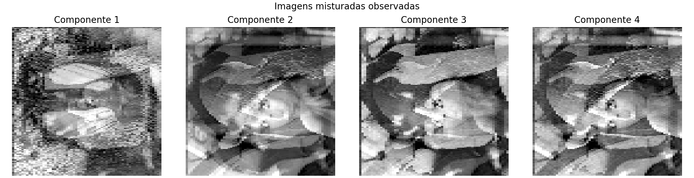
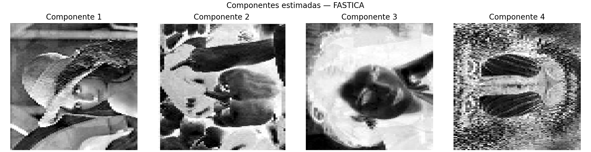
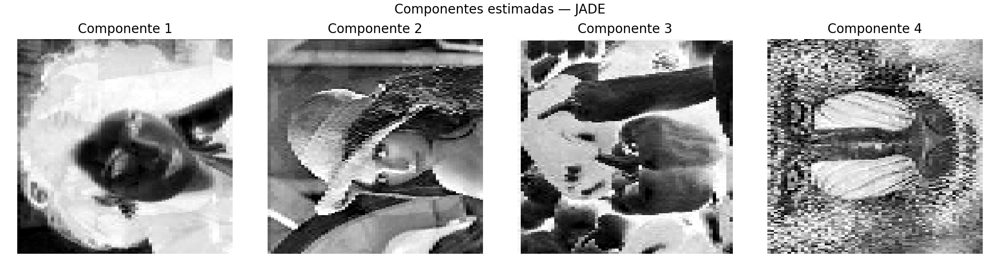

# Separação Cega de Imagens com ICA

Implementação do **Trabalho Prático 2 — Análise de Componentes Independentes em Dados Cegos**, com separação cega de quatro imagens misturadas utilizando **FastICA** e uma **abordagem aproximada de JADE baseada em cumulantes de quarta ordem**.

Repositório: https://github.com/higinomatheus/ica-blind-image-separation

## Objetivo

Estimar componentes independentes a partir de sinais observados, sem acesso às fontes originais ou à matriz de mistura. Como não há *ground truth*, a avaliação utiliza indicadores indiretos de independência e reconstrução das observações.

## Dados

- Arquivo de entrada: `mist_images.mat` (MATLAB).
- Variável utilizada: `X`, com dimensão `(16384, 4)` (ou sua transposta).
- Quatro sinais observados, cada um com 16.384 amostras, visualizados como imagens de **128 × 128 pixels** usando a ordem de colunas do MATLAB.

**Importante:** o arquivo `.mat` não está incluído neste pacote. Coloque o arquivo na pasta raiz do projeto ou informe seu caminho com `--input`. Verifique as condições de redistribuição antes de publicá-lo.

## Metodologia

1. Caracterização dos sinais: estatísticas, imagens, histogramas, espectros espaciais 2D e correlações.
2. **FastICA (principal):** quatro componentes, `logcosh`, branqueamento interno (`unit-variance`), tolerância `1e-6`, até 2.000 iterações e semente 42.
3. **JADE aproximado (comparação):** branqueamento explícito e diagonalização conjunta de matrizes de cumulantes de quarta ordem via otimização ortogonal BFGS e múltiplas inicializações. **Não** é a implementação de referência do JADE com rotações Jacobi.
4. Avaliação: correlação absoluta média, informação mútua estimada entre pares, excesso de curtose e erro relativo de reconstrução.

## Requisitos e execução

Recomenda-se Python 3.11 ou superior.

```bash
python3 -m venv .venv
source .venv/bin/activate
pip install -r requirements.txt
python experimento.py --input mist_images.mat
```

Caso o arquivo esteja na pasta acima do diretório do projeto:

```bash
python experimento.py --input ../mist_images.mat
```

O programa cria/atualiza `figuras/`, `resultados.json`, `saida_fastica.npz` e `saida_jade.npz` no mesmo diretório do script.

## Resultados de referência

| Métrica | Misturas | FastICA | JADE aproximado |
|---|---:|---:|---:|
| Correlação absoluta média | 0,728191 | ≈ 0 | ≈ 0 |
| Informação mútua média estimada (nats) | 0,680016 | 0,181155 | 0,194420 |
| Erro relativo de reconstrução | — | 2,56 × 10⁻¹⁶ | 2,63 × 10⁻¹⁶ |

Nesta execução, o FastICA apresentou menor informação mútua média estimada. A otimização do JADE aproximado retornou `converged=false`; por isso, não se afirma convergência certificada. **Reconstrução praticamente exata e descorrelação não comprovam recuperação das imagens originais.** As métricas podem variar com o ambiente, estimador e amostragem.

### Visualizações







## Estrutura do projeto

```text
.
├── README.md
├── experimento.py           # Script principal
├── requirements.txt        # Dependências Python
├── relatorio.tex           # Fonte LaTeX do relatório
├── relatorio.pdf           # Relatório compilado
├── resultados.json         # Métricas da execução
├── saida_fastica.npz       # Componentes e reconstrução
├── saida_jade.npz          # Componentes e reconstrução
└── figuras/                # Gráficos e imagens gerados
```

## Relatório técnico

Para compilar o arquivo `relatorio.tex` com uma distribuição LaTeX que contenha os pacotes utilizados:

```bash
pdflatex -interaction=nonstopmode relatorio.tex
pdflatex -interaction=nonstopmode relatorio.tex
```

O relatório documenta hipóteses, parâmetros, resultados e limitações metodológicas.

## Limitações

A separação é genuinamente cega: não há acesso às imagens originais, e a ordem, escala e sinal das componentes estimadas são ambíguos. Correlação nula não implica independência estatística; a informação mútua é estimada numericamente. Portanto, os resultados constituem evidência indireta, não validação absoluta das fontes recuperadas.
